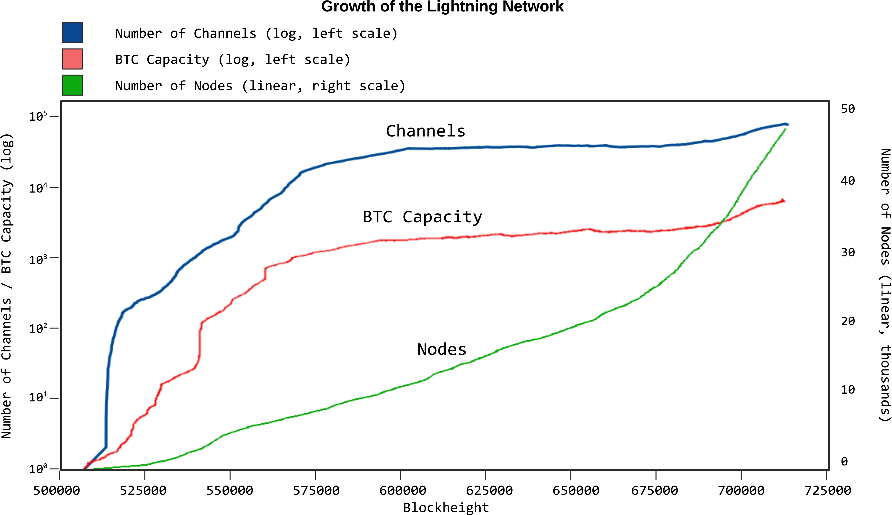

[[seguridad_y_privacidad]]
== Seguridad y Privacidad de pass:[Lightning Network]

((("seguridad y privacidad", id="ix_16_security_privacy_ln-asciidoc0", range="startofrange")))
En este capítulo, analizamos algunos de los problemas más importantes relacionados con la seguridad y la privacidad de Lightning Network. Primero, consideraremos la privacidad, lo que significa, cómo evaluarla y algunas cosas que puede hacer para proteger su propia privacidad mientras usa Lightning Network. Luego exploraremos algunos ataques comunes y técnicas de mitigación.

=== ¿Por qué la Privacidad es importante?

((("seguridad y privacidad","importancia de la privacidad"))) La propuesta de valor clave de la criptomoneda es que estamos ante dinero resistente a la censura. Bitcoin ofrece a los participantes la posibilidad de almacenar y transferir su riqueza sin interferencias de los gobiernos, bancos o corporaciones. Lightning Network continúa con esta misión.

A diferencia de las soluciones de escalado triviales como los bancos de custodia de Bitcoin, Lightning Network tiene como objetivo escalar Bitcoin sin comprometer la autocustodia, lo que debería conducir a una mayor resistencia a la censura en el ecosistema de Bitcoin. Sin embargo, Lightning Network opera bajo un modelo de seguridad diferente, que presenta nuevos desafíos de seguridad y privacidad.

=== Definiciones de privacidad

((("seguridad y privacidad","definiciones de privacidad", id="ix_16_security_privacy_ln-asciidoc1", range="startofrange"))) A la pregunta, "¿Es Lightning privado?", no hay una respuesta directa. La privacidad es un tema complejo; a menudo es difícil definir con precisión lo que entendemos por privacidad, especialmente si no eres un investigador de privacidad. Afortunadamente, los investigadores de la privacidad utilizan proceesos para analizar y evaluar las características de un sistema en cuanto a privacidad, ¡y nosotros podemos utilizarlas también! Veamos cómo un investigador de seguridad podría tratar de responder a la pregunta "¿Es Lightning privado?" en dos pasos generales.

Primero, un investigador de privacidad definiría un _modelo de seguridad_ que especifica lo que un adversario es capaz de hacer y pretende lograr.
Luego, describiría las propiedades relevantes del sistema y verificaría si cumple con los requisitos.

=== Proceso para evaluar la privacidad

((("seguridad y privacidad","proceso para evaluar la privacidad")))((("security assumptions")))
Un modelo de seguridad se basa en un conjunto de _supuestos de seguridad_ subyacentes.
En los sistemas criptográficos, estas suposiciones a menudo se centran en las propiedades matemáticas de las primitivas criptográficas, como cifrados, firmas y funciones hash.
Las suposiciones de seguridad de Lightning Network son que las firmas ECDSA, la función hash SHA-256 y otras funciones criptográficas utilizadas en el protocolo se comportan dentro de sus definiciones de seguridad.
Por ejemplo, asumimos que es prácticamente imposible encontrar una preimagen (y una segunda preimagen) de una función hash.
Esto permite que Lightning Network confíe en el mecanismo HTLC (que usa la preimagen de una función hash) para la atomicidad de los pagos multisalto: nadie excepto el destinatario final puede revelar el secreto del pago y resolver el HTLC.
También asumimos un grado de conectividad en la red, es decir, que los canales Lightning forman un gráfico conectado. Por lo tanto, es posible encontrar un camino desde cualquier emisor a cualquier receptor. Finalmente, asumimos que los mensajes de red se propagan dentro de ciertos tiempos de espera.

Ahora que hemos identificado algunas de nuestras suposiciones subyacentes, consideremos algunos posibles adversarios.

Estos son algunos modelos posibles de adversarios en Lightning Network.
Un nodo de reenvío "honesto pero curioso" puede observar los montos de los pagos, los nodos inmediatamente anteriores y posteriores, y el gráfico de los canales anunciados con sus capacidades.
Un nodo muy bien conectado puede hacer lo mismo pero en mayor medida.
Por ejemplo, considere a los desarrolladores de una billetera popular que mantienen un nodo al que sus usuarios se conectan de forma predeterminada.
Este nodo sería responsable de enrutar una gran parte de los pagos hacia y desde los usuarios de esa billetera.
¿Qué pasa si varios nodos están bajo control adversario?
Si dos nodos que confabulan se encuentran en la misma ruta de pago, entenderán que están reenviando HTLCs que pertenecen al mismo pago porque los HTLCs tienen el mismo hash de pago.

[NOTA]
====
Los Pagos Multiparte o también llamados Pagos Multiruta (ver <<mpp>>) permiten a los usuarios ofuscar sus montos de pago debido a sus tamaños de división no uniformes.
====

¿Cuáles pueden ser los objetivos de un atacante Lightning?
La seguridad de la información a menudo se describe en términos de tres propiedades principales: confidencialidad, integridad y disponibilidad.

Confidencialidad:: La información solo llega a los destinatarios previstos.
Integridad:: La información no se altera en tránsito.
Disponibilidad:: El sistema funciona la mayor parte del tiempo.

Las propiedades importantes de Lightning Network se centran principalmente en la confidencialidad y la disponibilidad. Algunas de las propiedades más importantes para la protección incluyen:

* Solo el remitente y el destinatario conocen el monto del pago.
* Nadie puede vincular emisores y receptores.
* Un usuario honesto no puede ser bloqueado para enviar y recibir pagos.

Para cada objetivo de privacidad y modelo de seguridad, existe una cierta probabilidad de que un atacante tenga éxito.
Esta probabilidad depende de varios factores, como el tamaño y la estructura de la red.
En igualdad de condiciones, generalmente es más fácil atacar con éxito una red pequeña que una grande.
Del mismo modo, cuanto más centralizada es la red, más capaz puede ser un atacante si los nodos "centrales" están bajo su control.
Por supuesto, el término centralización debe definirse con precisión para construir modelos de seguridad a su alrededor, y hay muchas definiciones posibles de qué tan centralizada es una red.
Finalmente, como red de pago, Lightning Network depende de estímulos económicos.
El tamaño y la estructura de las tarifas afectan el algoritmo de enrutamiento y, por lo tanto, pueden ayudar al atacante reenviando la mayoría de los pagos a través de sus nodos o evitar que esto suceda.(((range="endofrange", startref="ix_16_security_privacy_ln-asciidoc1")))

=== Conjunto de anonimato 
//Anonymity Set 

((("conjunto_de_anonimato")))((("desanonimizar")))((("seguridad y privacidad","conjunto de anonimato")))
¿Qué significa desanonimizar a alguien?
En términos simples, la desanonimización implica vincular alguna acción con la identidad del mundo real de una persona, como su nombre o dirección física.

En la investigación de la privacidad, la noción de desanonimización tiene más matices.
Primero, no estamos necesariamente hablando de nombres y direcciones.
Descubrir la dirección IP o el número de teléfono de alguien también puede considerarse anonimización.
Una pieza de información que permite vincular la acción de un usuario con sus acciones anteriores se denomina _identidad_.

En segundo lugar, la desanonimización no es binaria; un usuario no es completamente anónimo ni completamente desanonimizado.
En cambio, la investigación de privacidad analiza el anonimato en comparación con el conjunto de anonimato.

El _conjunto de anonimato_ es una noción central en la investigación de la privacidad.
Se refiere al conjunto de identidades tales que, desde el punto de vista de un atacante, una acción dada podría corresponder a cualquiera en el conjunto.
Considere un ejemplo de la vida real.
Imagina que conoces a una persona en una calle de la ciudad.
¿Cuál es su anonimato establecido desde tú punto de vista?
Si no lo conoces personalmente y sin ninguna información adicional, su conjunto de anonimato equivale aproximadamente a la población de la ciudad, incluidos los viajeros.
Si además consideras su apariencia, es posible que pueda estimar aproximadamente su edad y excluir a los residentes de la ciudad que obviamente son mayores o menores que la persona en cuestión del conjunto de anonimato.
Además, si observas que la persona ingresa a la oficina de la empresa X con una credencial electrónica,
//the anonymity set shrinks to the number pass:[of Company] X's employees and visitors.
el conjunto de anonimato se reduce al pase de número: de empleados y visitantes pass:[de la empresa] X.
Finalmente, puedes ver el número de matrícula del coche que utilizó para llegar al lugar.
Si eres un observador casual, esto no te da mucho.
Sin embargo, si tú eres un funcionario de la ciudad y tienes acceso a la base de datos que relaciona los números de matrícula con los nombres, puede reducir el anonimato establecido a solo unas pocas personas: el propietario del coche y cualquier amigo cercano y pariente que pueda haber tomado prestado dicho coche.

Este ejemplo ilustra algunos puntos importantes.
Primero, cada bit de información puede acercar al adversario a su objetivo.
Puede que no sea necesario reducir el conjunto de anonimato al tamaño de uno.
Por ejemplo, si el adversario planea un ataque de denegación de servicio (DoS) dirigido y puede derribar 100 servidores, el conjunto de anonimato de 100 es suficiente.
En segundo lugar, el adversario puede correlacionar información de diferentes fuentes.
Incluso si una fuga de privacidad parece relativamente benigna, nunca sabemos lo que puede lograr en combinación con otras fuentes de datos.
Finalmente, especialmente en configuraciones criptográficas, el atacante siempre tiene el "último recurso" de una búsqueda de fuerza bruta.
Las primitivas criptográficas están diseñadas para que sea prácticamente imposible adivinar un secreto como una clave privada.
Sin embargo, cada bit de información acerca al adversario a este objetivo y, en algún momento, se vuelve alcanzable.

En términos de Lightning, eliminar el anonimato generalmente significa derivar una correspondencia entre pagos y usuarios identificados por ID de nodo.
A cada pago se le puede asignar un conjunto de anonimato de remitente y un conjunto de anonimato de receptor.
Idealmente, el conjunto de anonimato consiste en todos los usuarios de la red.
Esto asegura que el atacante no tiene información alguna.
Sin embargo, la red real filtra información que permite a un atacante restringir la búsqueda.
Cuanto más pequeño sea el conjunto de anonimato, mayor será la posibilidad de una desanonimización exitosa.

[role="pagebreak-before less_space"]
=== Diferencias entre Lightning Network y Bitcoin en términos de privacidad

((("seguridad y privacidad","diferencias entre Lightning Network y Bitcoin en términos de privacidad", id="ix_16_security_privacy_ln-asciidoc2", range="startofrange")))Si bien es cierto que las transacciones en la red de Bitcoin no asocian identidades del mundo real con direcciones de Bitcoin, todas las transacciones se transmiten en texto no cifrado y se pueden analizar.
Se han creado varias empresas que buscan la forma de eliminar el anonimato de los usuarios de Bitcoin y otras criptomonedas.

A primera vista, Lightning brinda una mejor privacidad que Bitcoin porque los pagos de Lightning no se transmiten a toda la red.
Si bien esto mejora la línea base de privacidad, otras propiedades del protocolo Lightning pueden hacer que los pagos anónimos sean más desafiantes.
Por ejemplo, los pagos más grandes pueden tener menos opciones de enrutamiento.
Esto puede permitir que un adversario que controle nodos bien capitalizados enrute la mayoría de los pagos grandes y, que descubra los cantidades y probablemente otros detalles. Con el tiempo, a medida que crece Lightning Network, esto puede convertirse en un problema menor.

Otra diferencia relevante entre Lightning y Bitcoin es que los nodos Lightning mantienen una identidad permanente, mientras que los nodos Bitcoin no.
Un usuario sofisticado de Bitcoin puede cambiar fácilmente los nodos utilizados para recibir datos de la blockchain y transmitir transacciones.
Un usuario Lightning, por el contrario, envía y recibe pagos a través de los nodos que ha utilizado para abrir sus canales de pago.
Además, el protocolo Lightning asume que los nodos de enrutamiento anuncian su dirección IP además de su ID de nodo.
Esto crea un vínculo permanente entre los ID de nodo y las direcciones IP, lo que puede ser peligroso si se tiene en cuenta que una dirección IP suele ser un paso intermedio en los ataques de anonimato vinculados a la ubicación física del usuario y, en la mayoría de los casos, a la identidad del mundo real.
Es posible usar Lightning sobre Tor, pero muchos nodos no usan esta funcionalidad, como se puede ver en https://1ml.com/statistics[estadísticas recopiladas de los nodos anunciados].

Un usuario Lightning, al enviar un pago, tiene a sus vecinos en su conjunto de anonimato.
Específicamente, un nodo de enrutamiento solo conoce los nodos inmediatamente anteriores y posteriores.
El nodo de enrutamiento no sabe si sus vecinos inmediatos en la ruta de pago son el remitente o el receptor final.
Por lo tanto, el conjunto de anonimato de un nodo en Lightning es aproximadamente igual al de sus vecinos (ver <<conjunto_de_anonimato>>).

[[conjunto_de_anonimato]]
.El conjunto de anonimato de Alice y Bob lo constituyen sus vecinos
image::images/mtln_1601.png["El conjunto de anonimato de Alice y Bob lo constituyen sus vecinos"]

Se aplica una lógica similar a los receptores de pago. Muchos usuarios abren solo un puñado de canales de pago, lo que limita sus conjuntos de anonimato. Además, en Lightning, el conjunto de anonimato es estático o al menos cambia lentamente.

Por el contrario, uno puede lograr conjuntos de anonimato significativamente más grandes en transacciones CoinJoin en cadena. Las transacciones CoinJoin con conjuntos de anonimato mayores de 50 son bastante frecuentes.
Por lo general, los conjuntos de anonimato en una transacción CoinJoin corresponden a un conjunto de usuarios que cambia dinámicamente. Finalmente, a los usuarios de Lightning también se les puede negar el servicio, y un atacante puede bloquear o agotar sus canales.

El reenvío de pagos requiere que el capital (¡un recurso escaso!) se bloquee temporalmente en los HTLC a lo largo de la ruta. Un atacante puede enviar muchos pagos pero no finalizarlos, ocupando el capital de los usuarios honestos durante largos períodos.

Este vector de ataque no está presente (o al menos no es tan obvio) en Bitcoin. En resumen, aunque algunos aspectos de la arquitectura de Lightning Network sugieren que es un paso adelante en términos de privacidad en comparación con Bitcoin, otras propiedades del protocolo pueden facilitar los ataques a la privacidad. Se necesita una investigación exhaustiva para evaluar qué garantías de privacidad proporciona Lightning Network y mejorar la situación.

Los temas discutidos en esta parte del capítulo resumen la investigación disponible a mediados de 2021. Sin embargo, esta área de investigación y desarrollo está creciendo rápidamente. Nos complace informar que los autores conocen varios equipos de investigación que trabajan actualmente en la privacidad de Lightning. Ahora revisemos algunos de los ataques a la privacidad de LN que se han descrito en la literatura académica. (((range="endofrange", startref="ix_16_security_privacy_ln-asciidoc2")))

=== Ataques en Lightning

((("seguridad y privacidad","ataques en Lightning", seealso="violación de la privacidad", id="ix_16_security_privacy_ln-asciidoc3", range="startofrange")))Investigaciones recientes describen varias formas en las que la seguridad y la privacidad de Lightning Network pueden verse comprometidas.

==== Observando los montos de pago

((("violación de la privacidad","Observando los montos de pago")))Uno de los objetivos de un sistema de pago que preserva la privacidad es ocultar el monto del pago a las partes no involucradas.
Lightning Network es una mejora sobre la Capa 1 en este sentido.
Si bien las transacciones de Bitcoin se transmiten en texto sin cifrar y cualquier persona puede observarlas, los pagos Lightning solo viajan a través de unos pocos nodos a lo largo de la ruta de pago.
Sin embargo, los nodos intermediarios ven el monto del pago, aunque este monto del pago puede no corresponder al monto del pago total real (ver <<mpp>>).
Esto es necesario para crear un nuevo HTLC en cada salto.
La disponibilidad de montos de pago para los nodos intermediarios no presenta una amenaza inmediata.
Sin embargo, un nodo intermediario _honesto pero curioso_ puede usarlo como parte de un ataque mayor.

==== Vinculando remitentes y receptores

((("violación de la privacidad","vinculando remitentes y receptores", id="ix_16_security_privacy_ln-asciidoc4", range="startofrange")))Un atacante podría estar interesado en conocer el remitente y/o el receptor de un pago para revelar ciertas relaciones económicas.
Esta violación de la privacidad podría dañar la resistencia a la censura, ya que un nodo intermediario podría censurar los pagos hacia o desde ciertos destinatarios o remitentes.
Idealmente, la vinculación de remitentes con receptores no debería ser posible para nadie más que el remitente y el receptor.

En las siguientes secciones, consideraremos dos tipos de adversarios: el adversario fuera del camino y el adversario en el camino.

Un adversario fuera de la ruta intenta evaluar al remitente y al receptor de un pago sin participar en el proceso de enrutamiento del pago.
Un adversario en camino puede aprovechar cualquier información que pueda obtener enrutando el pago de intereses.

((("adversario fuera de la ruta")))Primero, considera al _adversario_ fuera de la ruta. En el primer paso de este escenario de ataque, un potente adversario fuera de ruta deduce los saldos individuales en cada canal de pago a través de un sondeo (descrito en una sección posterior) y forma una instantánea de la red en el momento __t~1~__. Para simplificar, hagamos que __t~1~__ sea igual a 12:05. Luego sondea la red nuevamente en algún momento posterior en el tiempo __t~2~__, que haremos 12:10. Luego, el atacante compararía las instantáneas a las 12:10 y las 12:05 y usaría las diferencias entre las dos instantáneas para inferir información sobre los pagos que se realizaron al observar las rutas que han cambiado. En el caso más simple, si solo se produjera un pago entre las 12:10 y las 12:05, el adversario observaría un único camino donde los saldos han cambiado en las mismas cantidades. Así, el adversario aprende casi todo sobre este pago: el remitente, el destinatario y el monto. Si varias rutas de pago se superponen, el adversario debe aplicar heurísticas para identificar dicha superposición y separar los pagos. 

((("adversario en la ruta"))) Ahora, dirigimos nuestra atención a un _adversario en la ruta_.
Tal adversario puede parecer complicado.
Sin embargo, en junio de 2020, los investigadores notaron que el único nodo más central https://arxiv.org/pdf/2006.12143.pdf[observó cerca del 50% de todos los pagos de LN], mientras que los cuatro nodos más centrales. https://arxiv.org/pdf/1909.06890.pdf[observó un promedio de 72% de pagos].

Estos hallazgos enfatizan la relevancia del modelo de atacante en ruta.
Aunque los intermediarios en una ruta de pago solo conocen a su sucesor y predecesor, existen varias filtraciones que un intermediario malicioso u honesto pero curioso, podría usar para inferir quién es el remitente y el destinatario.

El adversario en ruta puede observar el monto de cualquier pago enrutado, así como los deltas de bloqueo de tiempo (consulte <<onion_routing>>).
Por lo tanto, el adversario puede excluir cualquier nodo del conjunto de anonimato del remitente o del receptor con capacidades inferiores a la cantidad enrutada.
Por lo tanto, observamos una compensación entre privacidad y montos de pago.
Por lo general, cuanto mayor es el monto del pago, más pequeños son los conjuntos de anonimato.
Observamos que esta fuga podría minimizarse con pagos multiparte o con canales de pago de gran capacidad.
De manera similar, los canales de pago con pequeños deltas de bloqueo de tiempo podrían excluirse de una ruta de pago.
Más precisamente, un canal de pago no puede pertenecer a un pago si el tiempo restante durante el cual el pago podría estar bloqueado es mayor que el que el nodo de reenvío estaría dispuesto a aceptar.
Esta fuga podría ser desalojada adhiriéndose a las llamadas rutas sombra.

Una de las filtraciones más sutiles y poderosas que un adversario en ruta puede fomentar es el análisis de tiempo.
Un adversario en ruta puede mantener un registro de cada pago enrutado, junto con la cantidad de tiempo que tarda un nodo en responder a una solicitud HTLC.
Antes de comenzar el ataque, el atacante aprende las características de latencia de cada nodo en Lightning Network enviándoles solicitudes.
Naturalmente, esto puede ayudar a establecer la posición precisa del adversario en la ruta de pago.
Más aún, como se demostró recientemente, un atacante puede determinar con éxito el remitente y el destinatario de un pago a partir de un conjunto de posibles remitentes y destinatarios utilizando estimadores basados en el tiempo.

Finalmente, es importante reconocer que probablemente existan filtraciones desconocidas o no estudiadas que podrían ayudar a los intentos de anonimización. Por ejemplo, debido a que diferentes carteras Lightning aplican diferentes algoritmos de enrutamiento, incluso sabiendo que el algoritmo de enrutamiento aplicado podría ayudar a excluir ciertos nodos de ser un remitente y/o receptor de un pago.(((range="endofrange", startref="ix_16_security_privacy_ln-asciidoc4 ")))

==== Revelación de saldos de canales (Sondeo o "Probing")
//TO DO Esto hay que revisarlo
((("violación de la privacidad","revelación de saldos de canales", id="ix_16_security_privacy_ln-asciidoc5", range="startofrange")))((("channel balances, revealing", id="ix_16_security_privacy_ln-asciidoc6", range="startofrange")))((("channel probing", id="ix_16_security_privacy_ln-asciidoc7", range="startofrange")))((("probing attack", id="ix_16_security_privacy_ln-asciidoc8", range="startofrange")))Se supone que los saldos de los canales Lightning están ocultos por razones de privacidad y eficiencia.
Un nodo Lightning solo conoce los saldos de sus canales adyacentes.
El protocolo no proporciona una forma estándar de consultar el saldo de un canal remoto.

Sin embargo, un atacante puede revelar el saldo de un canal remoto en un _ataque de sondeo o "probing attack"_.
En seguridad de la información, el sondeo se refiere a la técnica de enviar solicitudes a un sistema objetivo y sacar conclusiones sobre su estado privado en función de las respuestas recibidas.

Los canales de rayos son propensos a sondear. 
Recuerde que un pago Lightning estándar comienza cuando el receptor crea un secreto de pago aleatorio y envía su hash al remitente. 
Tenga en cuenta que para los nodos intermediarios, todos los hashes parecen aleatorios. 
No hay forma de saber si un hash corresponde a un secreto real o si se generó aleatoriamente.

El ataque de sondeo procede de la siguiente manera.
Digamos que el atacante Mallory quiere revelar el saldo de Alice de un canal público entre Alice y Bob. 
Supongamos que la capacidad total de ese canal es de 1 millón de satoshis. 
El saldo de Alice puede oscilar entre cero y 1 millón de satoshis (para ser precisos, la estimación es un poco más ajustada debido a la reserva de canales, pero no la tomamos en cuenta aquí por simplicidad).
Mallory abre un canal con Alice con 1 millón de satoshis y envía 500 000 satoshis a Bob a través de Alice usando un _número aleatorio_ como hash de pago. 
Por supuesto, este número no corresponde a ningún secreto de pago conocido. Por lo tanto, el pago fallará. 
La pregunta es: ¿cómo fallará exactamente? 

Existen dos escenarios.
Si Alice posee mas de 500.000 satoshis en su lado del canal con Bob, ella envia el pago.

Bob descifra la cebolla de pago y se da cuenta de que el pago está destinado a él.
Busca en su tienda local de secretos de pago y busca la preimagen que corresponde al hash de pago, pero no la encuentra.
Siguiendo el protocolo, Bob devuelve el error de "hash de pago desconocido" a Alice, quien se lo transmite a Mallory.
Como resultado, Mallory sabe que el pago _podría haber tenido éxito_ si el hash del pago fuera real.
Por lo tanto, Mallory puede actualizar su estimación del saldo de Alice de "entre cero y 1 millón" a "entre 500.000 y 1 millón".
Otro escenario ocurre si el saldo de Alice es inferior a 500.000 satoshis.
En ese caso, Alice no puede envíar el pago y devuelve el error de "saldo insuficiente" a Mallory.
Mallory actualiza su estimación de "entre cero y 1 millón" a "entre cero y 500.000".

Tenga en cuenta que, en cualquier caso, la estimación de Mallory se vuelve el doble de precisa después de un solo sondeo.
Puede continuar sondeando, eligiendo la siguiente cantidad de sondeo de modo que divida el intervalo de estimación actual por la mitad.
((("búsqueda binaria"))) Esta conocida técnica de búsqueda se llama _búsqueda binaria_.
Con la búsqueda binaria, el número de sondas es _logarítmico_ con la precisión deseada.
Por ejemplo, para obtener el saldo de Alice en un canal de 1 millón de satoshis hasta un solo satoshi, Mallory solo tendría que realizar log~2~ (1.000.000) =  20 sondeos.
Si un sondeo tarda 3 segundos, ¡un canal se puede sondear con precisión en solo un minuto!

El sondeo de canales se puede hacer aún más eficiente.
En su variante más simple, Mallory se conecta directamente al canal que quiere sondear.
¿Es posible sondear un canal sin abrir un canal a uno de sus puntos finales?
Imagine que Mallory ahora quiere probar un canal entre Bob y Charlie, pero no quiere abrir otro canal, lo que requiere pagar tarifas en cadena y esperar confirmaciones de las transacciones de financiación.
En cambio, Mallory reutiliza su canal existente a Alice y envía una sonda a lo largo de la ruta Mallory -> Alice -> Bob -> Charlie.
Mallory puede interpretar el error "hash de pago desconocido" de la misma manera que antes: la sonda ha llegado al destino; por lo tanto, todos los canales a lo largo de la ruta tienen saldos suficientes para reenviarlo.
Pero, ¿y si Mallory recibe el error de "saldo insuficiente"?
¿Significa que el equilibrio es insuficiente entre Alice y Bob o entre Bob y Charlie?

En el protocolo Lightning actual, los mensajes de error informan no solo _cuál_ error ocurrió sino también _dónde_ sucedió.
Entonces, con un manejo de errores más cuidadoso, Mallory ahora sabe qué canal falló.
Si este es el canal objetivo, actualiza sus estimaciones; si no, elige otra ruta hacia el canal de destino.
Incluso obtiene información _adicional_ sobre los saldos de los canales intermediarios, además de la del canal de destino.

El ataque de sondeo se puede utilizar además para vincular remitentes y receptores, como se describe en la sección anterior.

En este punto, puede preguntarse: ¿por qué Lightning Network hace un trabajo tan pobre en la protección de los datos privados de sus usuarios?
¿No sería mejor no revelar al remitente por qué y dónde ha fallado el pago?
De hecho, esto podría ser una contramedida potencial, pero tiene importantes inconvenientes.
Lightning tiene que lograr un cuidadoso equilibrio entre privacidad y eficiencia.
Recuerde que los nodos regulares no conocen las distribuciones de saldos en los canales remotos.
Por lo tanto, los pagos pueden fallar (y a menudo lo hacen) debido a un saldo insuficiente en un salto intermediario.
Los mensajes de error permiten al remitente excluir el canal que falla al construir otra ruta.
Una billetera Lightning popular incluso realiza un sondeo interno para verificar si una ruta construida realmente puede manejar un pago.

Existen otras contramedidas potenciales contra el sondeo de canales.
Primero, es difícil para un atacante apuntar a canales no anunciados.
En segundo lugar, los nodos que implementan enrutamiento justo a tiempo (JIT) pueden ser menos propensos al ataque.
Finalmente, dado que los pagos de varias partes hacen que el problema de la capacidad insuficiente sea menos grave, los desarrolladores del protocolo pueden considerar ocultar algunos de los detalles del error sin dañar la eficiencia.
(((range="endofrange", startref="ix_16_security_privacy_ln-asciidoc8")))(((range="endofrange", startref="ix_16_security_privacy_ln-asciidoc7")))(((range="endofrange", startref="ix_16_security_privacy_ln-asciidoc6")))(((range="endofrange", startref="ix_16_security_privacy_ln-asciidoc5")))

[[denegacion_de_servicio]]
==== Denegación de Servicio

((("violación de la privacidad","ataques de denegación de servicio", id="ix_16_security_privacy_ln-asciidoc9", range="startofrange")))((("ataques denegación-de-servicio (DoS)", id="ix_16_security_privacy_ln-asciidoc10", range="startofrange")))Cuando los recursos se ponen a disposición del público, existe el riesgo de que los atacantes intenten hacer que ese recurso no esté disponible mediante la ejecución de un ataque de denegación de servicio o "denial of service" (DoS).
Generalmente, esto se logra cuando el atacante bombardea un recurso con solicitudes, que son indistinguibles de las consultas legítimas.
Los ataques rara vez dan como resultado que el objetivo sufra pérdidas financieras, aparte del costo de oportunidad de la caída de su servicio, y simplemente tienen la intención de agraviar al objetivo.

Las mitigaciones típicas de los ataques DoS requieren la autenticación de las solicitudes para separar a los usuarios legítimos de los malintencionados. Estas mitigaciones incurren en un costo trivial para los usuarios regulares, pero actuarán como un impedimento suficiente para que un atacante inicie solicitudes a gran escala.
Las medidas contra la denegación de servicio se pueden ver en todas partes en Internet: los sitios web aplican límites de velocidad para garantizar que ningún usuario pueda consumir toda la atención de su servidor, los sitios de reseñas de películas requieren autenticación de inicio de sesión para mantener a raya a los miembros cabreados de r/prequelmemes (grupo Reddit), y los servicios de datos venden claves API para limitar el número de consultas.

===== DoS en Bitcoin

((("Bitcoin (sistema)","Ataques DoS")))((("ataques denegación-de-servicio (DoS)","DoS en Bitcoin")))En Bitcoin, el ancho de banda que utilizan los nodos para transmitir transacciones y el espacio que aprovechan para la red en forma de su mempool son recursos disponibles públicamente.
Cualquier nodo de la red puede consumir ancho de banda y espacio de mempool enviando una transacción válida.
Si esta transacción se extrae en un bloque válido, pagarán tarifas de transacción, lo que agrega un costo al uso de estos recursos de red compartidos.

En el pasado, la red Bitcoin se enfrentó a un intento de ataque DoS en el que los atacantes enviaron spam a la red con transacciones de bajo costo.
Muchas de estas transacciones no fueron seleccionadas por los mineros debido a sus bajas tarifas de transacción, por lo que los atacantes podían consumir recursos de la red sin pagar las tarifas.
Para abordar este problema, se estableció una tarifa mínima de retransmisión de transacciones que establece una tarifa de umbral que los nodos requieren para propagar transacciones.
Esta medida aseguró en gran medida que las transacciones que consumen recursos de la red finalmente pagarán sus tarifas de cadena.
La tarifa mínima de retransmisión es aceptable para los usuarios habituales, pero perjudicaría financieramente a los atacantes si intentaran enviar spam a la red.
Si bien es posible que algunas transacciones no se conviertan en bloques válidos en entornos de tarifas altas, estas medidas han sido en gran medida efectivas para disuadir este tipo de spam.

===== DoS en Lightning

((("ataques denegación-de-servicio (DoS)","DoS en Lightning")))De manera similar a Bitcoin, Lightning Network cobra tarifas por el uso de sus recursos públicos, pero en este caso, los recursos son canales públicos y las tarifas vienen en forma de tarifas de enrutamiento. La capacidad de enrutar pagos a través de nodos a cambio de tarifas brinda a la red un gran beneficio de escalabilidad (los nodos que no están conectados directamente aún pueden realizar transacciones), pero tiene el costo de exponer un recurso público que debe protegerse contra ataques DoS. 
Cuando un nodo Lightning reenvía un pago en su nombre, utiliza datos y ancho de banda de pago para actualizar su transacción de compromiso, y el monto del pago se reserva en el saldo de su canal hasta que se liquide o falle. En pagos exitosos, esto es aceptable porque el nodo finalmente paga sus tarifas. Los pagos fallidos no incurren en cargos en el protocolo actual. Esto permite que los nodos enruten sin costo los pagos fallidos a través de cualquier canal. Esto es excelente para usuarios legítimos, a quienes no les gustaría pagar por intentos fallidos, pero también permite a los atacantes consumir los recursos de los nodos sin costo, al igual que las transacciones de bajo costo en Bitcoin que nunca terminan pagando las tarifas de los mineros.

En el momento de escribir este artículo, hay un debate https://lists.linuxfoundation.org/pipermail/lightning-dev/2020-June/002734.html[en curso] en la lista de correo de lightning-dev sobre la mejor manera de abordar este problema.

===== Ataque conocidos de DoS

((("ataques denegación-de-servicio (DoS)","ataque conocidos de DoS")))Hay dos ataques DoS conocidos en canales LN públicos que inutilizan un canal de destino, o un conjunto de canales de destino.
Ambos ataques implican el enrutamiento de pagos a través de un canal público y luego retenerlos hasta su tiempo de espera, lo que maximiza la duración del ataque.
El requisito de fallar en los pagos para no pagar las tarifas es bastante simple de cumplir porque los nodos maliciosos pueden simplemente redirigir los pagos hacia ellos mismos.
En ausencia de tarifas por pagos fallidos, el único costo para el atacante es el costo en cadena de abrir un canal para enviar estos pagos, lo que puede ser trivial en entornos de tarifas bajas.(((range="endofrange", startref="ix_16_security_privacy_ln-asciidoc10")))(((range="endofrange", startref="ix_16_security_privacy_ln-asciidoc9")))

==== Commitment Jamming o Interferencia de compromiso

((("violación de la privacidad","commitment jamming")))((("commitment jamming")))Los nodos Lightning actualizan su estado compartido mediante transacciones de compromiso asimétricas, en las que se agregan y eliminan HTLC para facilitar los pagos.
Cada parte está limitada a un total de https://github.com/lightningnetwork/lightning-rfc/blob/c053ce7afb4cbf88615877a0d5fc7b8dbe2b9ba0/02-peer-protocol.md#the-open_channel-message[483] HTLC en la transacción de compromiso a la vez.
Un ataque de interferencia de canal permite que un atacante inutilice un canal enrutando 483 pagos a través del canal de destino y reteniéndolos hasta que se agote el tiempo de espera.

Cabe señalar que este límite se eligió en la especificación para garantizar que todos los HTLC se puedan barrer en una https://github.com/lightningnetwork/lightning-rfc/blob/master/05-onchain.md#penalty-transaction-peso-cálculo[transacción única de justicia].
Si bien este límite _puede_ aumentarse, las transacciones aún están limitadas por el tamaño del bloque, por lo que es probable que la cantidad de espacios disponibles siga siendo limitada.

==== Channel Liquidity Lockup o Bloqueo de liquidez del canal

((("violación de la privacidad","channel liquidity lockup")))((("channel liquidity lockup")))Un ataque de bloqueo de liquidez del canal es comparable a un ataque de bloqueo del canal en el sentido de que enruta los pagos a través de un canal y los retiene para que el canal quede inutilizable.
En lugar de bloquear espacios en el compromiso del canal, este ataque enruta grandes HTLC a través de un canal de destino, consumiendo todo el ancho de banda disponible del canal.
El compromiso de capital de este ataque es más alto que el ataque de interferencia de compromiso porque el nodo atacante necesita más fondos para enrutar los pagos fallidos a través del objetivo.(((range="endofrange", startref="ix_16_security_privacy_ln-asciidoc3")))

=== Cross-Layer De-Anonymization o Desanonimización de capas cruzadas

((("violación de la privacidad","cross-layer de-anonymization", id="ix_16_security_privacy_ln-asciidoc11", range="startofrange")))((("cross-layer de-anonymization", id="ix_16_security_privacy_ln-asciidoc12", range="startofrange")))((("seguridad y privacidad","cross-layer de-anonymization", id="ix_16_security_privacy_ln-asciidoc13", range="startofrange")))Las redes informáticas suelen estar en capas.
La estratificación permite la separación de preocupaciones y hace que todo el sistema sea manejable.
Nadie podría diseñar un sitio web si requiriera comprender toda la pila de TCP/IP hasta la codificación física de bits en un cable óptico.
Se supone que cada capa proporciona la funcionalidad a la capa superior de una manera limpia.
Idealmente, la capa superior debería percibir una capa inferior como una caja negra.
En realidad, sin embargo, las implementaciones no son ideales y los detalles se filtran a la capa superior.
Este es el problema de las abstracciones con fugas.

En el contexto de Lightning, el protocolo LN se basa en el protocolo Bitcoin y la red LN P2P.
Hasta este punto, solo consideramos las garantías de privacidad que ofrece Lightning Network de forma aislada.
Sin embargo, la creación y el cierre de canales de pago se realizan inherentemente en la cadena de bloques de Bitcoin.
En consecuencia, para un análisis completo de las disposiciones de privacidad de Lightning Network, es necesario considerar cada capa de la pila tecnológica con la que los usuarios podrían interactuar.
Específicamente, un adversario anonimizado puede y usará datos dentro y fuera de la cadena para agrupar o vincular nodos LN a las direcciones de Bitcoin correspondientes.

Los atacantes que intentan eliminar el anonimato de los usuarios de LN pueden tener varios objetivos, en un contexto de capas cruzadas:

  * Clúster de direcciones Bitcoin propiedad del mismo usuario (Capa 1). Llamamos a estas entidades Bitcoin.
  * Nodos de LN de clúster que es propiedad del mismo usuario (Capa 2).
  * Vincular sin ambigüedades los conjuntos de nodos LN a los conjuntos de entidades Bitcoin que los controlan.

Hay varias heurísticas y patrones de uso que permiten a un adversario agrupar direcciones de Bitcoin y nodos de LN propiedad de los mismos usuarios de LN.
Además, estos clústeres se pueden vincular a través de capas utilizando otras potentes heurísticas de vinculación entre capas.
El último tipo de heurística, las técnicas de enlace entre capas, enfatiza la necesidad de una visión holística de la privacidad. Específicamente, debemos considerar la privacidad en el contexto de ambas capas juntas.

==== Agrupación de entidades de Bitcoin On-chain 
((("Entidades Bitcoin","entity clustering")))((("cross-layer de-anonymization","on-chain Bitcoin entity clustering")))((("on-chain Bitcoin entity clustering")))Las interacciones de la cadena de bloques Lightning Network se reflejan permanentemente en el gráfico de entidades de Bitcoin.
Incluso si un canal está cerrado, un atacante puede observar qué dirección fondeó el canal y dónde se gastaron las monedas después de cerrarlo.
Para este análisis, consideremos cuatro entidades separadas.
La apertura de un canal provoca un flujo monetario de una _entidad origen ("source")_ a una _entidad financiadora ("funding")_; el cierre de un canal provoca un flujo desde una _entidad de liquidación ("settlement")_ a una _entidad de destino ("destination")_.

A principios de 2021, https://arxiv.org/pdf/2007.00764.pdf[Romiti et al.] identificó cuatro heurísticas que permiten la agrupación de estas entidades.
Dos de ellos capturan cierto comportamiento de financiación con fugas y dos describen comportamientos de liquidación con fugas.

Heurística de estrella (financiación):: Si un componente contiene una entidad de origen que reenvía fondos a una o más entidades de financiación, es probable que estas entidades de financiación estén controladas por el mismo usuario.
Heurística de serpiente (financiación):: si un componente contiene una entidad de origen que reenvía fondos a una o más entidades, que a su vez se utilizan como entidades de origen y de financiación, es probable que todas estas entidades estén controladas por el mismo usuario.
Heurística del recopilador (liquidación):: si un componente contiene una entidad de destino que recibe fondos de una o más entidades de liquidación, es probable que estas entidades de liquidación estén controladas por el mismo usuario.
Proxy heurístico (liquidación):: Si un componente contiene una entidad de destino que recibe fondos de una o más entidades, que a su vez se utilizan como entidades de liquidación y destino, es probable que estas entidades estén controladas por el mismo usuario.

Vale la pena señalar que estas heurísticas pueden producir falsos positivos.
Por ejemplo, si las transacciones de varios usuarios no relacionados se combinan en una transacción CoinJoin, entonces la estrella o la heurística de proxy pueden producir falsos positivos.
Esto podría suceder si los usuarios están financiando un canal de pago a partir de una transacción CoinJoin.
Otra fuente potencial de falsos positivos podría ser que una entidad pudiera representar a varios usuarios si las direcciones agrupadas están controladas por un servicio (por ejemplo, intercambio) o en nombre de sus usuarios (cartera de custodia).
Sin embargo, estos falsos positivos se pueden filtrar de manera efectiva.

===== Contramedidas
Si los resultados de las transacciones de financiación no se reutilizan para abrir otros canales, la heurística de la serpiente no funciona.
Si los usuarios se abstienen de utilizar canales de financiación de una única fuente externa y evitan recaudar fondos en una única entidad de destino externa, las otras heurísticas no arrojarían ningún resultado significativo.

==== Agrupación Off-Chain de nodos Lightning
((("cross-layer de-anonymization","off-chain Lightning node clustering")))((("Lightning node clustering")))((("off-chain Lightning node clustering")))Los nodos de LN anuncian alias, por ejemplo, _LNBig.com_.
Los alias pueden mejorar la usabilidad del sistema.
Sin embargo, los usuarios tienden a usar alias similares para sus propios nodos diferentes.
Por ejemplo, es probable que _LNBig.com Billing_ sea propiedad del mismo usuario que el nodo con el alias _LNBig.com_.
Dada esta observación, uno puede agrupar nodos LN aplicando sus alias de nodo.
Específicamente, uno agrupa los nodos LN en una sola dirección si sus alias son similares con respecto a alguna métrica de similitud de cadenas.
Otro método para agrupar nodos LN es aplicar sus direcciones IP o Tor.
Si las mismas direcciones IP o Tor corresponden a diferentes nodos LN, es probable que estos nodos estén controlados por el mismo usuario.

===== Contramedidas
Para mayor privacidad, los alias deben ser lo suficientemente diferentes entre sí.
Si bien el anuncio público de direcciones IP puede ser inevitable para aquellos nodos que desean tener canales entrantes en Lightning Network, la capacidad de vinculación entre nodos del mismo usuario puede mitigarse si los clientes de cada nodo están alojados con diferentes proveedores de servicios y, por lo tanto, direcciones IP.

==== Enlace de capa cruzada o Cross-Layer Linking: Nodos Lightning y Entidades Bitcoin
((("Bitcoin entities","cross-layer linking to Lightning nodes")))((("violación de la privacidad","cross-layer linking: Lightning nodes and Bitcoin entities")))((("cross-layer de-anonymization","cross-layer linking: Lightning nodes and Bitcoin entities")))((("Lightning node operation","cross-layer linking to Bitcoin entities")))Asociar nodos LN a entidades Bitcoin es una violación grave de la privacidad que se ve agravada por el hecho de que la mayoría de los nodos LN exponen públicamente sus direcciones IP.
Por lo general, una dirección IP se puede considerar como un identificador único de un usuario.
Dos patrones de comportamiento ampliamente observados revelan vínculos entre los nodos LN y las entidades de Bitcoin:

Reutilización de monedas:: Cada vez que los usuarios cierran los canales de pago, recuperan sus monedas correspondientes. Sin embargo, muchos usuarios reutilizan esas monedas para abrir un nuevo canal.
Esas monedas se pueden vincular efectivamente a un nodo LN común.

Reutilización de entidades:: por lo general, los usuarios financian sus canales de pago desde direcciones de Bitcoin correspondientes a la misma entidad de Bitcoin.

Estos algoritmos de vinculación de capas cruzadas podrían frustrarse si los usuarios poseen múltiples direcciones no agrupadas o usan múltiples billeteras para interactuar con Lightning Network.

La posible anonimización de las entidades de Bitcoin ilustra lo importante que es considerar la privacidad de ambas capas simultáneamente en lugar de una a la vez.(((range="endofrange", startref="ix_16_security_privacy_ln-asciidoc13")))(((range="endofrange", startref="ix_16_security_privacy_ln-asciidoc12")))(((range="endofrange", startref="ix_16_security_privacy_ln-asciidoc11")))

//TODO from author:  maybe here we should/could include the corresponding figures from the Romiti et al. paper. it would greatly improve and help the understanding of the section

=== Lightning Graph

((("Lightning graph", id="ix_16_security_privacy_ln-asciidoc14", range="startofrange")))((("seguridad y privacidad","Lightning graph", id="ix_16_security_privacy_ln-asciidoc15", range="startofrange")))Lightning Network, como sugiere su nombre, es una red de canales de pago entre pares.
Por lo tanto, muchas de sus propiedades (privacidad, robustez, conectividad, eficiencia de enrutamiento) están influenciadas y caracterizadas por su naturaleza de red.

En esta sección, discutimos y analizamos Lightning Network desde el punto de vista de la ciencia de redes.
Estamos particularmente interesados en comprender el gráfico de canal LN, su robustez, conectividad y otras características importantes.

==== ¿Cómo se ve el gráfico de rayos en la realidad?
((("Lightning graph","reality versus theoretical appearance of", id="ix_16_security_privacy_ln-asciidoc16", range="startofrange")))Uno podría haber esperado que Lightning Network sea un gráfico aleatorio, donde los bordes se forman aleatoriamente entre los nodos.
Si este fuera el caso, entonces la distribución de grados de Lightning Network seguiría una distribución normal gaussiana.
En particular, la mayoría de los nodos tendrían aproximadamente el mismo grado y no esperaríamos nodos con grados extraordinariamente grandes.
Esto se debe a que la distribución normal disminuye exponencialmente para valores fuera del intervalo alrededor del valor promedio de la distribución.
La representación de un gráfico aleatorio (como vimos en <<lngraph>>) parece una topología de red en malla.
Parece descentralizado y no jerárquico: cada nodo parece tener la misma importancia.
Además, los gráficos aleatorios tienen un gran diámetro.
En particular, el enrutamiento en dichos gráficos es un desafío porque el camino más corto entre dos nodos cualesquiera es moderadamente largo.
Sin embargo, en marcado contraste, el gráfico LN es completamente diferente.

===== Gráfico de relámpagos hoy
Lightning es una red financiera.
Así, el crecimiento y la formación de la red también están influenciados por incentivos económicos.
Cada vez que un nodo se une a Lightning Network, es posible que desee maximizar su conectividad con otros nodos para aumentar su eficiencia de enrutamiento. Este fenómeno se llama apego preferencial.
Estos incentivos económicos dan como resultado una red fundamentalmente diferente a un gráfico aleatorio.

Basado en instantáneas de canales anunciados públicamente, la distribución de grados de Lightning Network sigue una función de ley de potencia.
En dicho gráfico, la gran mayoría de los nodos tienen muy pocas conexiones con otros nodos, mientras que solo unos pocos nodos tienen numerosas conexiones.
En un nivel alto, esta topología gráfica se parece a una estrella: la red tiene un núcleo bien conectado y una periferia débilmente conectada.
Las redes con distribución de grado de ley de potencia también se denominan redes sin escala.
Esta topología es ventajosa para enrutar pagos de manera eficiente, pero es propensa a ciertos ataques basados en topología.

===== Ataques basados en topología

((("Lightning graph","topology-based attacks")))((("topology-based attacks")))Un adversario podría querer interrumpir Lightning Network y decidir que su objetivo es desmantelar toda la red en muchos componentes más pequeños, haciendo que el enrutamiento de pagos sea prácticamente imposible en toda la red.

Un objetivo menos ambicioso, pero aún malicioso y severo, podría ser solo eliminar ciertos nodos de la red.
Tal interrupción puede ocurrir en el nivel de nodo o en el nivel de borde.

Supongamos que un adversario puede derribar cualquier nodo en Lightning Network.
Por ejemplo, puede atacarlos con un ataque de denegación de servicio distribuido (DDoS) o hacerlos no operativos por cualquier medio.
Resulta que si el adversario elige nodos al azar, las redes libres de escala como Lightning Network son sólidas contra los ataques de eliminación de nodos.
Esto se debe a que un nodo aleatorio se encuentra en la periferia con una pequeña cantidad de conexiones, por lo que juega un papel insignificante en la conectividad de la red.
Sin embargo, si el adversario es más prudente, puede apuntar a los nodos mejor conectados.
No es de extrañar que Lightning Network y otras redes libres de escala _no_ sean sólidas contra los ataques dirigidos de eliminación de nodos.

Por otro lado, el adversario podría ser más sigiloso.
Varios ataques basados en topología tienen como objetivo un solo nodo o un solo canal de pago.
Por ejemplo, un adversario podría estar interesado en agotar la capacidad de un determinado canal de pago a propósito.
En términos más generales, un adversario puede agotar toda la capacidad de salida de un nodo para eliminarlo del mercado de enrutamiento.
Esto podría obtenerse fácilmente enrutando los pagos a través del nodo víctima con montos equivalentes a la capacidad de salida de cada canal de pago.
Después de completar este llamado ataque de aislamiento de nodos, la víctima ya no puede enviar ni enrutar pagos a menos que reciba un pago o reequilibre sus canales.

Para concluir, incluso por diseño, es posible eliminar bordes y nodos de la Lightning Network enrutable.
Sin embargo, dependiendo del vector de ataque utilizado, el adversario puede tener que proporcionar más o menos recursos para llevar a cabo el ataque.

===== Temporalidad de la Lightning Network

((("Lightning graph","temporality of Lightning Network and")))((("temporality of Lightning Network")))Lightning Network es una red sin permiso que cambia dinámicamente.
Los nodos pueden unirse o abandonar libremente la red, pueden abrir y crear canales de pago en cualquier momento que lo deseen.
Por lo tanto, una sola instantánea estática del gráfico LN es engañosa. Necesitamos considerar la temporalidad y la naturaleza siempre cambiante de la red. Por ahora, el gráfico LN está creciendo en términos de número de nodos y canales de pago.
Su diámetro efectivo también se está reduciendo; es decir, los nodos se vuelven más cercanos entre sí, como podemos ver en <<temporal_ln>>.

[[temporal_ln]]
.El crecimiento constante de Lightning Network en nodos, canales y capacidad bloqueada (a partir de septiembre de 2021)

En las redes sociales, el comportamiento de cierre de triángulos es común.
Específicamente, en un gráfico donde los nodos representan personas y las amistades se representan como bordes, se espera que surjan triángulos en el gráfico.
Un triángulo, en este caso, representa amistades por parejas entre tres personas.
Por ejemplo, si Alice conoce a Bob y Bob conoce a Charlie, es probable que en algún momento Bob le presente a Alice a Charlie.
Sin embargo, este comportamiento sería extraño en Lightning Network.
Los nodos simplemente no están incentivados para cerrar triángulos porque podrían haber enrutado los pagos en lugar de abrir un nuevo canal de pago.
Sorprendentemente, el cierre de triángulos es una práctica común en Lightning Network.
El número de triángulos crecía constantemente antes de la implementación de los pagos en varias partes.
Esto es contrario a la intuición y sorprendente dado que los nodos podrían haber enrutado los pagos a través de los dos lados del triángulo en lugar de abrir el tercer canal.
Esto puede significar que las ineficiencias en el enrutamiento incentivaron a los usuarios a cerrar triángulos y no recurrir al enrutamiento.
Con suerte, los pagos de varias partes ayudarán a aumentar la eficacia del enrutamiento de pagos.(((range="endofrange", startref="ix_16_security_privacy_ln-asciidoc16"))).(((range="endofrange", startref="ix_16_security_privacy_ln-asciidoc15")))(((range="endofrange", startref="ix_16_security_privacy_ln-asciidoc14")))

=== Centralización en Lightning Network

((("betweenness centrality")))((("central point dominance")))((("centralization, Lightning Network and")))((("seguridad y privacidad","centralization in Lightning Network")))Una métrica común para evaluar la centralidad de un nodo en un gráfico es su _centralidad de intermediación_. El dominio del punto central es una métrica derivada de la centralidad de intermediación, que se utiliza para evaluar la centralidad de una red.
Para una definición precisa de la dominancia del punto central, se remite al lector a https://doi.org/10.2307/3033543 [trabajo de Freeman].

Cuanto mayor sea el dominio del punto central de una red, más centralizada será la red.
Podemos observar que Lightning Network tiene un mayor dominio del punto central (es decir, está más centralizado) que un gráfico aleatorio (gráfico de Erdős-Rényi) o un gráfico sin escala (gráfico de Barabási-Albert) de igual tamaño.

En general, nuestra comprensión de la naturaleza dinámica del gráfico de canales LN es bastante limitada.
Es fructífero analizar cómo los cambios de protocolo, como los pagos de varias partes, pueden afectar la dinámica de Lightning Network.
Sería beneficioso explorar la naturaleza temporal del gráfico LN con más profundidad.

=== Incentivos económicos y estructura gráfica

((("Lightning graph","economic incentives and graph structure")))((("seguridad y privacidad","economic incentives and graph structure")))El gráfico LN se forma espontáneamente y los nodos se conectan entre sí en función del interés mutuo.
Como resultado, los incentivos impulsan el desarrollo de gráficos.
Veamos algunos de los incentivos relevantes:

  * Incentivos racionales:
    -Los nodos establecen canales para enviar, recibir y enrutar pagos (ganar tarifas).
    -¿Qué hace más probable que se establezca un canal entre dos nodos que actúan racionalmente?
  * Incentivos altruistas:
    -Los nodos establecen canales "por el bien de la red".
    -Si bien no debemos basar nuestras suposiciones de seguridad en el altruismo, hasta cierto punto, el comportamiento altruista impulsa a Bitcoin (aceptar conexiones entrantes, servir bloques).
    -¿Qué papel juega en Lightning?

En las primeras etapas de Lightning Network, muchos operadores de nodos afirmaron que las tarifas de enrutamiento ganadas no compensan los costos de oportunidad derivados del bloqueo de liquidez. Esto indicaría que operar un nodo puede estar impulsado principalmente por incentivos altruistas "por el bien de la red".
Esto podría cambiar en el futuro si Lightning Network tiene un tráfico significativamente mayor o si surge un mercado de tarifas de enrutamiento.
Por otro lado, si un nodo desea optimizar sus tarifas de enrutamiento, minimizaría las longitudes de ruta más cortas promedio a todos los demás nodos.
Dicho de otra manera, un nodo que busca ganancias intentará ubicarse en el _centro_ del gráfico de canal o cerrar pass:[to it].

=== Consejos prácticos para que los usuarios protejan su privacidad

((("seguridad y privacidad","practical advice for users to protect privacy")))Todavía estamos en las primeras etapas de Lightning Network.
Es probable que muchas de las preocupaciones enumeradas en este capítulo se aborden a medida que madure y crezca.
Mientras tanto, hay algunas medidas que puede tomar para proteger su nodo contra usuarios maliciosos; algo tan simple como actualizar los parámetros predeterminados con los que se ejecuta su nodo puede ser de gran ayuda para fortalecer su nodo.

=== Canales no anunciados

((("payment channel","unannounced channels")))((("seguridad y privacidad","unannounced channels")))((("unannounced channels")))Si tiene la intención de usar Lightning Network para enviar y recibir fondos entre nodos y billeteras que controla, y no tiene interés en enrutar los pagos de otros usuarios, no hay necesidad de anunciar sus canales al resto de la red.
Podría abrir un canal entre, por ejemplo, su PC de escritorio que ejecuta un nodo completo y su teléfono móvil que ejecuta una billetera Lightning, y simplemente renunciar al anuncio del canal discutido en <<ch03_How_Lightning_Works>>.
Estos a veces se denominan canales "privados"; sin embargo, es más correcto referirse a ellos como canales "no anunciados" porque no son estrictamente privados.

Los canales no anunciados no serán conocidos por el resto de la red y normalmente no se utilizarán para enrutar los pagos de otros usuarios.
Todavía se pueden usar para enrutar pagos si otros nodos se dan cuenta de ellos; por ejemplo, una factura podría contener sugerencias de enrutamiento que sugieran una ruta con un canal no anunciado.
Sin embargo, suponiendo que solo haya abierto un canal sin previo aviso con usted mismo, obtendrá cierta medida de privacidad.
Dado que no está exponiendo su canal a la red, reduce el riesgo de un ataque de denegación de servicio en su nodo.
También puedes administrar más fácilmente la capacidad de este canal, ya que solo se utilizará para recibir o enviar directamente a tu nodo.

También hay ventajas en abrir un canal no anunciado con una parte conocida con la que realiza transacciones con frecuencia.
Por ejemplo, si Alice y Bob juegan con frecuencia al póquer por bitcoins, podrían abrir un canal para enviar sus ganancias de un lado a otro.
En condiciones normales, este canal no se utilizará para enrutar pagos de otros usuarios o cobrar tarifas.
Y dado que el canal no será conocido por el resto de la red, los pagos entre Alice y Bob no se pueden inferir mediante el seguimiento de los cambios en la capacidad de enrutamiento del canal.
Esto confiere cierta privacidad a Alice y Bob; sin embargo, si uno de ellos decide hacer que otros usuarios conozcan el canal, por ejemplo, incluyéndolo en las sugerencias de enrutamiento de una factura, entonces se pierde esta privacidad.

También se debe tener en cuenta que para abrir un canal no anunciado, se debe realizar una transacción pública en la cadena de bloques de Bitcoin.
Por lo tanto, es posible inferir la existencia y el tamaño del canal si una parte malintencionada está monitoreando la cadena de bloques en busca de transacciones de apertura de canales e intentando relacionarlas con los canales de la red.
Además, cuando se cierre el canal, el saldo final del canal se hará público una vez que esté comprometido con la cadena de bloques de Bitcoin.
Sin embargo, dado que las transacciones de apertura y compromiso son seudónimas, no será sencillo volver a conectarlo con Alice o Bob.
Además, la actualización de Taproot de 2021 dificulta distinguir entre transacciones de apertura y cierre de canales y otros tipos específicos de transacciones de Bitcoin.
Por lo tanto, si bien los canales no anunciados no son completamente privados, brindan algunos beneficios de privacidad cuando se usan con cuidado.

[[routing_considerations]]
=== Consideraciones de enrutamiento

((("denial-of-service (DoS) attacks","protecting against")))((("routing","security/privacy considerations")))((("seguridad y privacidad","routing considerations")))Como se cubre en <<denial_of_service>>, los nodos que abren canales públicos se exponen al riesgo de una serie de ataques a sus canales.
Si bien se están desarrollando mitigaciones a nivel de protocolo, hay muchos pasos que un nodo puede tomar para protegerse contra ataques de denegación de servicio en sus canales públicos:

Tamaño mínimo de HTLC:: en el canal abierto, su nodo puede establecer el tamaño mínimo de HTLC que aceptará.
Establecer un valor más alto garantiza que cada uno de los espacios de canal disponibles no pueda ser ocupado por un pago muy pequeño.
Limitación de velocidad:: muchas implementaciones de nodos permiten que los nodos acepten o rechacen dinámicamente los HTLC que se reenvían a través de su nodo.

Algunas pautas útiles para un limitador de velocidad personalizado son las siguientes:
+
** Limite la cantidad de espacios de compromiso que un solo par puede consumir
** Monitoree las tasas de fallas de un solo par y limite la tasa si sus fallas aumentan repentinamente
Canales ocultos: los nodos que deseen abrir grandes canales a un solo objetivo pueden, en cambio, abrir un solo canal público al objetivo y admitirlo con más canales privados llamados https://anchor.fm/tales-from-the-crypt/episodes/197-Joost-Jager-ekghn6[shadow channels]. Estos canales aún se pueden usar para el enrutamiento, pero no se anuncian a los posibles atacantes.

==== Aceptar canales
((("routing","accepting channels")))En la actualidad, los nodos Lightning tienen dificultades para arrancar la liquidez entrante. Si bien hay algunos pagados
soluciones para adquirir liquidez entrante, como servicios de intercambio, mercados de canales y servicios de apertura de canales pagados de centros conocidos, muchos nodos aceptarán con gusto cualquier solicitud de apertura de canales que parezca legítima para aumentar su liquidez entrante.

Volviendo al contexto de Bitcoin, esto se puede comparar con la forma en que Bitcoin Core trata sus conexiones entrantes y salientes de manera diferente debido a la preocupación de que el nodo pueda ser eclipsado.
Si un nodo abre una conexión entrante a su nodo de Bitcoin, no tiene forma de saber si el iniciador lo seleccionó al azar o si está apuntando específicamente a su nodo con intenciones maliciosas.
Sus conexiones salientes no necesitan ser tratadas con tanta sospecha porque el nodo se seleccionó al azar de un grupo de muchos pares potenciales o usted se conectó intencionalmente al par manualmente.

Lo mismo se puede decir en Lightning.
Cuando abre un canal, lo hace con intención, pero cuando una parte remota abre un canal a su nodo, no tiene forma de saber si este canal se utilizará para atacar su nodo o no.
Como señalan varios artículos, el costo relativamente bajo de activar un nodo y abrir canales a los objetivos es uno de los factores importantes que facilitan los ataques.
Si acepta canales entrantes, es prudente colocar algunas restricciones en los nodos de los que acepta canales entrantes.
Muchas implementaciones exponen ganchos de aceptación de canales que le permiten adaptar sus políticas de aceptación de canales a sus preferencias.

La cuestión de aceptar y rechazar canales es filosófica.
¿Qué pasa si terminamos con una Lightning Network donde los nuevos nodos no pueden participar porque no pueden abrir ningún canal?
Nuestra sugerencia no es establecer una lista exclusiva de "mega-hubs" desde los cuales aceptará canales, sino aceptar canales de una manera que se adapte a su preferencia de riesgo.

Algunas estrategias potenciales son:

Sin riesgo:: No acepte ningún canal entrante.
Bajo riesgo: acepte canales de un conjunto conocido de nodos con los que haya abierto previamente canales exitosos.
Riesgo medio:: solo acepta canales de nodos que han estado presentes en el gráfico durante un período más largo y tienen algunos canales de larga duración.
Mayor riesgo:: acepte cualquier canal entrante e implemente las mitigaciones descritas en <<consideraciones_de_ruteo>>.

=== Conclusión
En resumen, la privacidad y la seguridad son temas complejos y matizados, y aunque muchos investigadores y desarrolladores buscan mejoras en toda la red, es importante que todos los que participan en la red entiendan lo que pueden hacer para proteger su propia privacidad y aumentar la seguridad en un nivel de nodo individual.

=== Referencias y lecturas adicionales

En este capítulo, usamos muchas referencias de investigaciones en curso sobre seguridad Lightning. Puede encontrar estos artículos y documentos útiles enumerados por tema en las siguientes listas.

==== Ataques de privacidad y sondeo

* Jordi Herrera-Joancomartí et al. https://eprint.iacr.org/2019/328["On the Difficulty of Hiding the Balance of Lightning Network Channels"]. _Asia CCS '19: Proceedings of the 2019 ACM Asia Conference on Computer and Communications Security_ (July 2019): 602–612.
* Utz Nisslmueller et al. "Toward Active and Passive Confidentiality Attacks on Cryptocurrency Off-Chain Networks." arXiv preprint, https://arxiv.org/abs/2003.00003[] (2020).
* Sergei Tikhomirov et al. "Probing Channel Balances in the Lightning Network." arXiv preprint, https://arxiv.org/abs/2004.00333[] (2020).
* George Kappos et al. "An Empirical Analysis of Privacy in the Lightning Network." arXiv preprint, https://arxiv.org/abs/2003.12470[] (2021).
* https://github.com/LN-Zap/zap-desktop/blob/v0.7.2-beta/services/grpc/router.methods.js[Zap source code with the probing function].

===== Ataques de congestión

* Ayelet Mizrahi and Aviv Zohar. "Congestion Attacks in Payment Channel Networks." arXiv preprint, https://arxiv.org/abs/2002.06564[] (2020).

===== Consideraciones de enrutamiento

* Marty Bent, interview with Joost Jager, _Tales from the Crypt_, podcast audio, October 2, 2020, https://anchor.fm/tales-from-the-crypt/episodes/197-Joost-Jager-ekghn6[].(((range="endofrange", startref="ix_16_security_privacy_ln-asciidoc0")))

